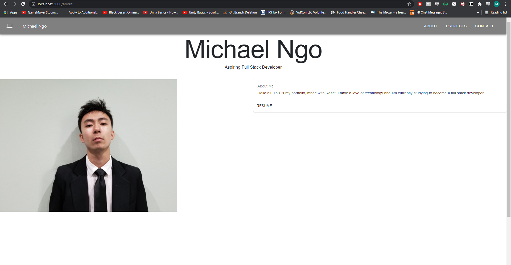
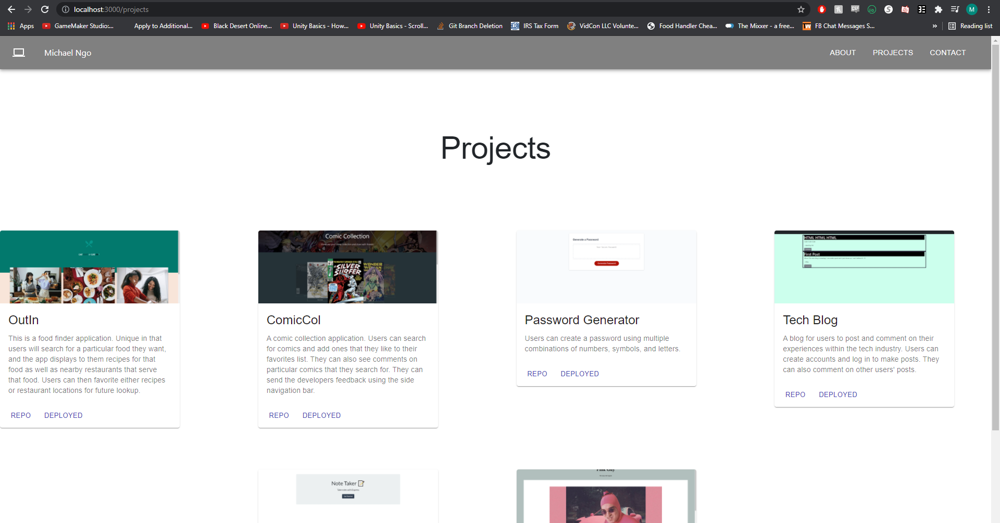
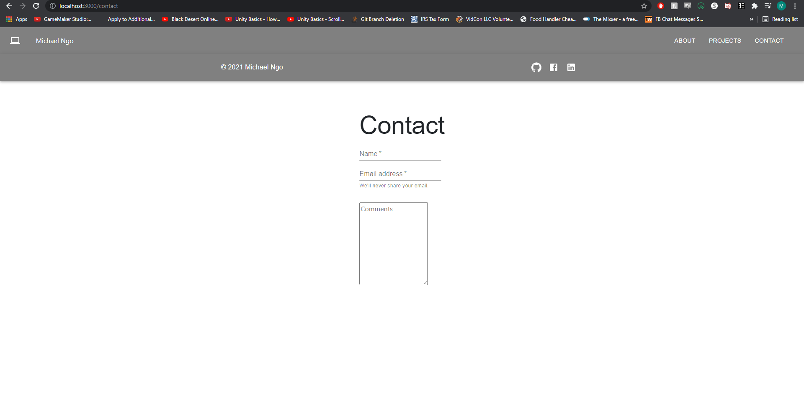

# React Portfolio

  
  

      

  ### Table of Contents
  [Description](https://github.com/DeviantSchemist/react-portfolio#description)

  [Installation](https://github.com/DeviantSchemist/react-portfolio#installation)

  [Usage](https://github.com/DeviantSchemist/react-portfolio#usage)

  [Contribution](https://github.com/DeviantSchemist/react-portfolio#contribution)

  [Tests](https://github.com/DeviantSchemist/react-portfolio#tests)

  [Questions](https://github.com/DeviantSchemist/react-portfolio#questions)

  ## NOTICE
  This application did not deploy correctly on github pages. See below screenshots for proof of the
  local version working.

  ## Description
  A portofolio showcasing my abilities as a developer. Made with React.

  ## Installation
  Clone this repo and open it in your preferred IDE/text editor. Run the command "npm i" inside of your node.js enabled editor and it will install all of the dependencies for you.

  ## Usage
  After installing everything, run the command "npm start" in order to start your local server connection at port 3000. It will then automatically open in your default browser window.

  ## Contribution
  Clone this repo onto your local computer. Then make a new branch whose name is based on whatever feature you are working. After you have finished the implementation, submit a pull request for further review.

  ## Tests
  No tests are available as this is a portfolio.

  ## Questions
  If you have additional questions, please see below for my contact information.

  ## About Page
  

  ## Project Page
  

  ## Contact Page
  

  ## Contact Information

  Github: [deviantschemist](https://github.com/deviantschemist)

  Email: michaelngo1337@yahoo.com